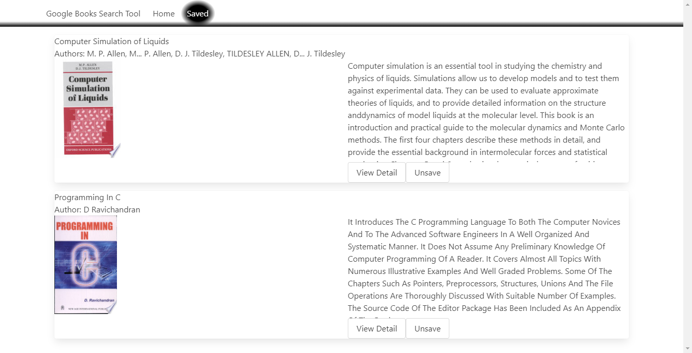

# book-search
## Description
Application for searching Google books (https://www.googleapis.com/books)  

## Table of Contents
1. [Usage](#Usage)
2. [Screenshots](#Screenshots)
3. [License](#License)
4. [Tests](#Tests)
5. [Questions?](#Questions)

## Usage
The application is deployed on Heroku. [Link to deployed app.](https://andrew-booksearch.herokuapp.com)
## Screenshots

## License
This project uses a MIT license.
## Tests
Integration tests for express API
## Questions
You can find my github account at
[andrew836-dev](https://github.com/andrew836-dev)  
Or you can email me andrew.aj.gray@gmail.com
